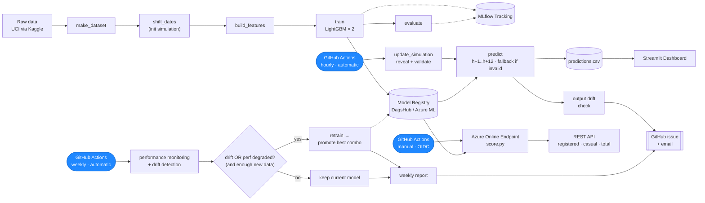

# Bike Sharing Demand Forecasting

> A production-style hourly demand forecasting system for a bike sharing operator, simulating a live environment where new data arrives every hour, predictions run continuously, and the model retrains itself when data drift is detected — with a parallel cloud deployment on Azure ML.


---

## Overview

Bike sharing operators face a constant operational question: **how many bikes will be needed in the next few hours?** Under-supply means lost revenue and frustrated users; over-supply means wasted rebalancing effort.

This project builds an **end-to-end, production-style ML system** that forecasts hourly bike demand and runs as if it were live: new data arrives every hour, gets validated, predictions run continuously, and the system monitors itself, retrains when warranted, and alerts a human when something needs attention. The modelling is the small part — the point is the MLOps machinery around it: versioned data and experiments, data-quality gating with a graceful fallback, a recursive multi-horizon forecast, three independent drift/performance monitors, performance-triggered retraining, automated model promotion, GitHub-issue + email alerting, and an operations dashboard — all on free-tier infrastructure, with a **parallel Azure ML deployment** mirroring the same concepts on managed cloud.

The system predicts demand for the **next twelve hours** given current conditions and recent history, splitting predictions between **registered** (commuters) and **casual** (recreational) riders, which follow very different daily patterns.

> **📘 Read the [Technical Overview](docs/overview.md)** — a guided tour of the whole system and the reasoning behind each design decision. It's the best single entry point to what this project demonstrates.

---

## Key Results

| Metric | Value | What it means |
|---|---|---|
| RMSE | ~51 bikes/hr | On a typical hour the model is off by about 51 bikes |
| RMSLE | ~0.23 | Average relative error of roughly 23% |
| R² | ~0.95 | The model explains about 95% of demand variability |
| Skill vs. seasonal-naive | ~58% lower RMSE at h+1 | Roughly halves the error of "same hour last week" |

Evaluated on a strict temporal hold-out (chronological split — never random, which would leak future information). See the [Model Card](docs/model_card.md) for the full breakdown.

---

## Architecture

The system separates a **static pipeline** (run when code or data definitions change) from a **dynamic production layer** (run continuously on a schedule).



- **Hourly:** reveal and validate newly-arrived records, forecast the next 12 hours (falling back to last week's demand if data fails validation), log the trajectory, check output drift, and alert if needed.
- **Weekly:** monitor live performance, check for input drift, and — if drift or performance decay warrants it *and* enough new data has accumulated — retrain and promote the best (registered, casual) combination by combined RMSE.

See the [Technical Overview](docs/overview.md) for the guided walkthrough, or [Architecture](docs/architecture.md) for the full design (monitoring stack, dashboard, and key decisions).

---

## Cloud Deployment

The same MLOps stack is mirrored on **Azure ML** — training as a Command Job, a model registry, a managed online endpoint serving `registered / casual / total` over REST, and OIDC-authenticated CI/CD — running in parallel with the live DagsHub system without touching it. See [Azure Deployment](docs/azure.md) for the full walkthrough, cost, and lessons learned.

---

## Quick Start

First configure your Kaggle and DagsHub credentials (see [Setup & Usage](docs/usage.md#3-configure-credentials)), then:

```bash
conda create -n bike-sharing-forecast python=3.11 -y
conda activate bike-sharing-forecast
make install    # install dependencies + this package

make setup      # download dataset + initialize the simulation (run once)
make repro      # run the full pipeline: features -> train -> evaluate
make predict    # reveal new records and predict
make dashboard  # launch the operations dashboard
```

Full setup — credentials, Docker, the complete `make` command reference, and project structure — is in [Setup & Usage](docs/usage.md).

---

## Documentation

| Document | Contents |
|---|---|
| [**Technical Overview**](docs/overview.md) | **Start here** — end-to-end guided tour of the system and the reasoning behind each design decision |
| [Architecture](docs/architecture.md) | System design, static vs dynamic layers, data flow, key decisions |
| [Multi-Horizon Forecasting](docs/forecasting.md) | Recursive trajectory serving, per-horizon monitoring, primary-horizon filtering, dashboard charts |
| [Feature Engineering](docs/feature_engineering.md) | EDA insights, engineered features, mutual information ranking, decisions |
| [Model Card](docs/model_card.md) | Model description, metrics, intended use, limitations |
| [Simulation](docs/simulation.md) | How the simulation works, initialization, reset, configuration |
| [Azure Deployment](docs/azure.md) | Cloud architecture, training jobs, endpoint, OIDC CI/CD, cost, lessons learned |
| [Setup & Usage](docs/usage.md) | Install, credentials, running the pipeline, Docker, make commands, project structure |

---

## Tech Stack

| Category | Tools |
|---|---|
| Model | LightGBM, Scikit-learn |
| Tuning | Optuna |
| Explainability | SHAP |
| Experiment tracking & registry | MLflow (hosted on DagsHub) |
| Data & pipeline versioning | DVC (remote on DagsHub) |
| Configuration | Hydra |
| Drift detection | Evidently |
| Dashboard | Streamlit, Plotly |
| Automation | GitHub Actions |
| Containerization | Docker, Docker Compose |
| Lint, format & testing | Ruff, Pytest |
| Cloud | Azure ML (Workspace, Model Registry, Managed Online Endpoint) |

---

## Data

**Source:** [UCI Bike Sharing Dataset](https://archive.ics.uci.edu/dataset/275/bike+sharing+dataset) — downloaded via a Kaggle mirror (see [Setup & Usage](docs/usage.md#1-prerequisites))
**Records:** 17,379 hourly observations (2011–2012)
**Target:** `cnt` — total bike rentals per hour, modelled as `registered + casual`

Dates are shifted to simulate a live environment; the underlying demand patterns remain those of the original 2011–2012 data. This is a deliberate simulation, not a claim of real-time data.

---

## Author

**Roberto Garcés** — Data Scientist
[GitHub](https://github.com/robertogarces) · [LinkedIn](https://www.linkedin.com/in/robertogarcesf/)
