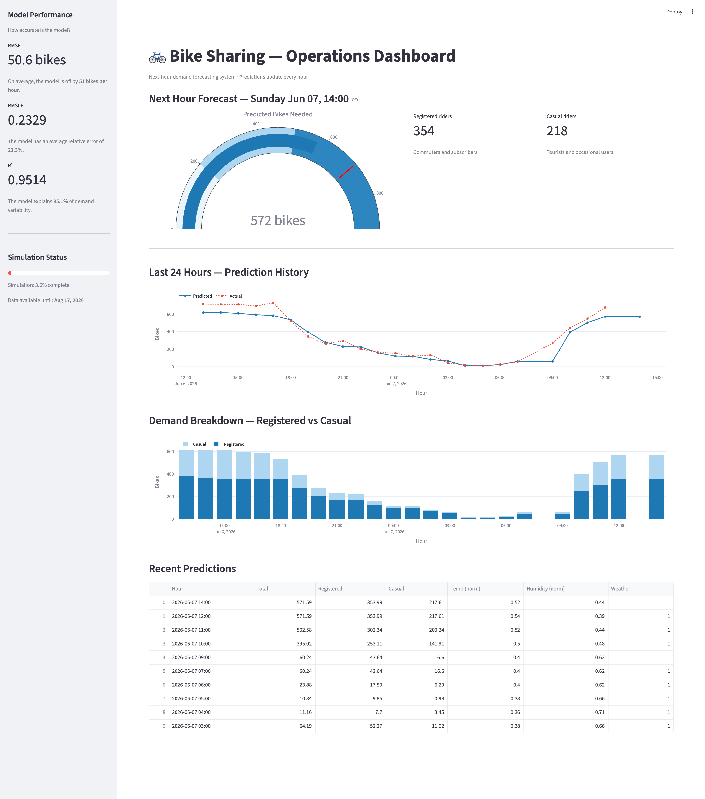
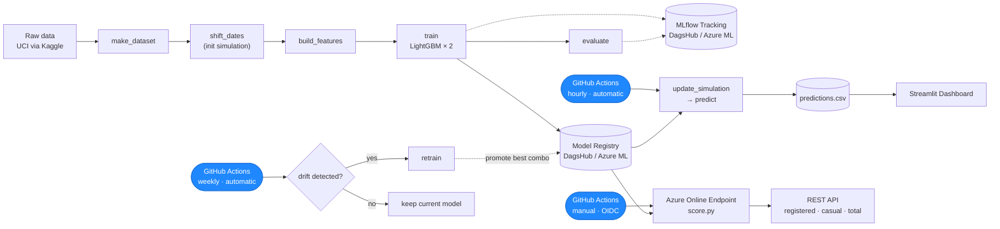
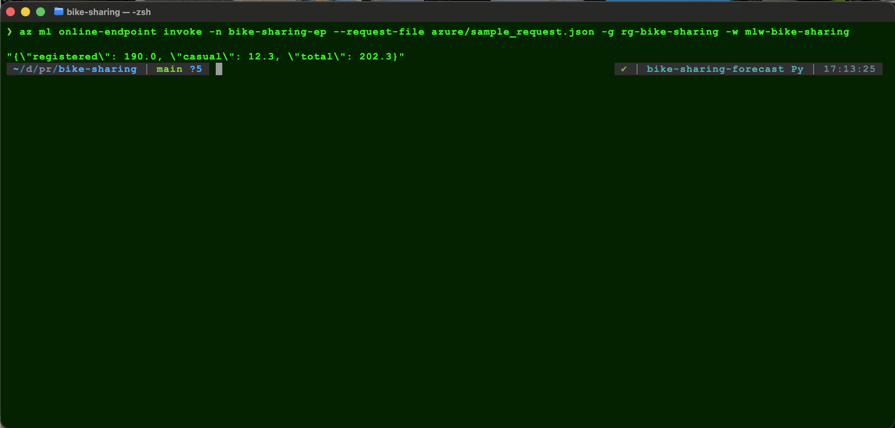
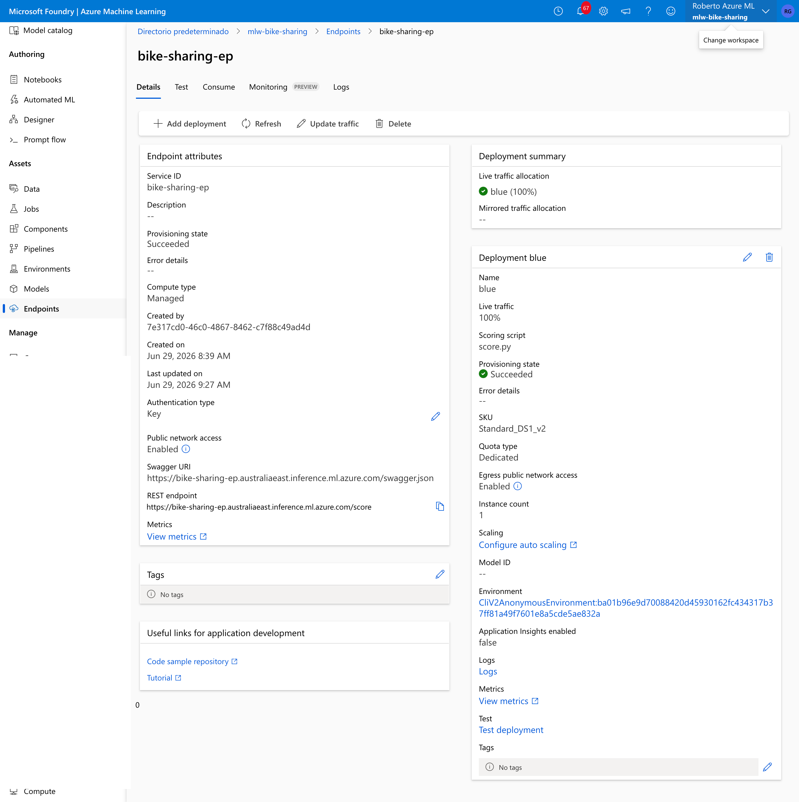
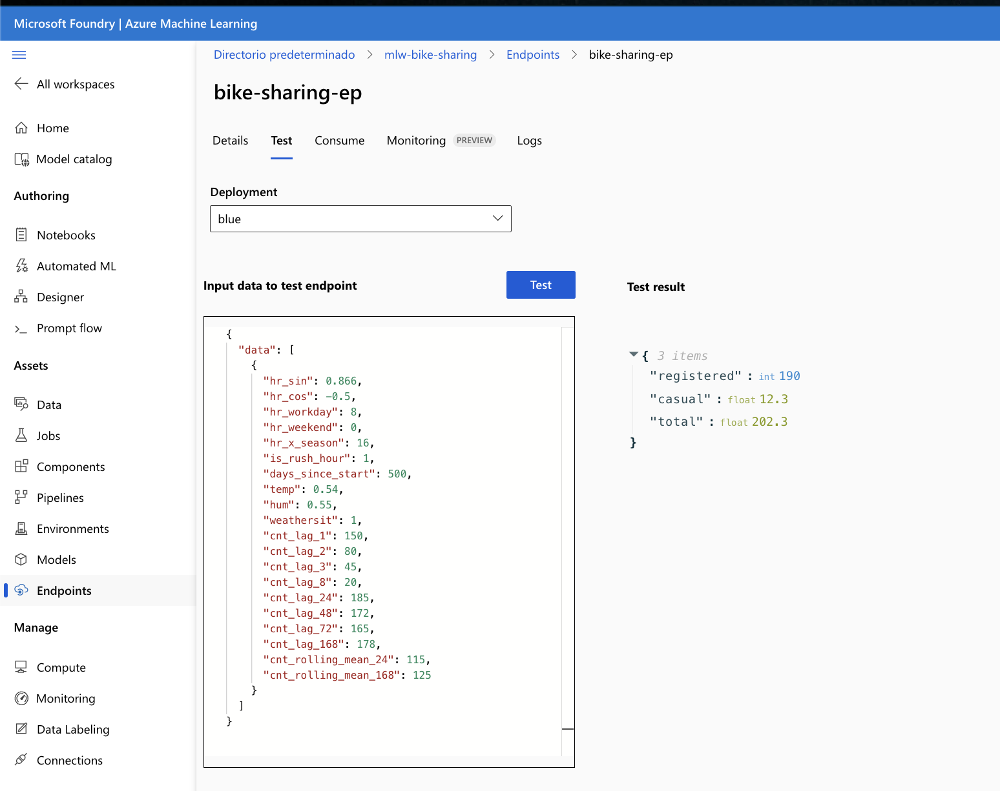
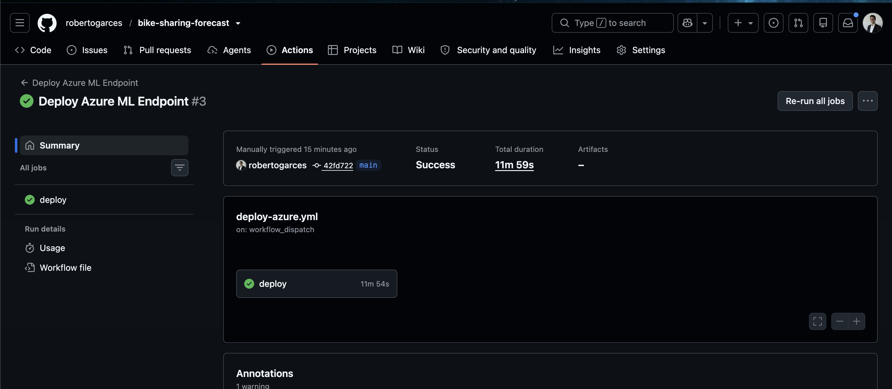

# Bike Sharing Demand Forecasting

> A production-style hourly demand forecasting system for a bike sharing operator, simulating a live environment where new data arrives every hour, predictions run continuously, and the model retrains itself when data drift is detected — with a parallel cloud deployment on Azure ML.


---

## Overview

Bike sharing operators face a constant operational question: **how many bikes will be needed in the next hour?** Under-supply means lost revenue and frustrated users; over-supply means wasted rebalancing effort.

This project builds an end-to-end system that forecasts hourly bike demand and operates as if it were live in production. It is a continuously running pipeline with versioned data, tracked experiments, automated retraining, drift monitoring, and an operations dashboard.

The system predicts demand for the **next twelve hours** given current conditions and recent history, splitting predictions between **registered** (commuters) and **casual** (recreational) riders, which follow very different daily patterns. See [`docs/forecasting.md`](docs/forecasting.md) for how a single next-hour model is served as a multi-hour forecast.

---

## Operations Dashboard

The Streamlit dashboard has two pages: **Operations**, built for what an operator should act on right now (a next-12-hours forecast trajectory, next peak/quietest hours), and **Monitoring**, built for whether the model is healthy (live performance, drift status, retrain outcomes). See [`docs/architecture.md`](docs/architecture.md#dashboard) for the full breakdown.


*Screenshot predates the dashboard redesign — kept for now as a placeholder.*

---

## Key Results

| Metric | Value | What it means |
|---|---|---|
| RMSE | ~51 bikes/hr | On a typical hour the model is off by about 51 bikes |
| RMSLE | ~0.23 | Average relative error of roughly 23% |
| R² | ~0.95 | The model explains about 95% of demand variability |

The model is a tuned LightGBM trained on the UCI Bike Sharing dataset, evaluated on a strict temporal hold-out (never a random split, which would leak future information).

---

## The Simulation

The UCI dataset covers 2011–2012. To make the project behave like a live system, dates are shifted so that the most recent slice of data sits in the near future relative to a configurable reference date. As real time advances, records move from "future" to "past" one hour at a time, exactly as new observations would arrive in production.

This means the system genuinely runs forward in time until the future data is exhausted — predictions, drift checks, and retraining all operate on a moving window.

The simulation is fully configurable: the reference date and the fraction of data reserved for the future are set in `configs/simulation/default.yaml`. A state file guards against accidental resets.

See [`docs/simulation.md`](docs/simulation.md) for details.

---

## Architecture

The system separates a **static pipeline** (run when code or data definitions change) from a **dynamic production layer** (run continuously on a schedule).



- **Hourly:** reveal newly-arrived records, predict the next hour, log the prediction.
- **Weekly:** check for data drift; if drift exceeds a threshold (and enough new data exists), retrain and promote whichever (registered, casual) combination has the lowest combined RMSE — see [`docs/architecture.md`](docs/architecture.md#5-key-design-decisions) for why this can produce a mixed pair.

See [`docs/architecture.md`](docs/architecture.md) for the full design.

---

## Azure Deployment

This project includes a cloud deployment layer using Azure ML, running **in parallel** with the existing DagsHub + GitHub Actions setup — the live hourly system remains untouched. The purpose is to gain hands-on experience with production-grade MLOps on a managed platform: model registry, REST inference API, and CI/CD with federated authentication.

> 📖 For the full walkthrough — training on Azure compute, design decisions, cost control, and lessons learned — see [`docs/azure.md`](docs/azure.md).

### What was deployed

| Component | Azure Service |
|---|---|
| Data versioning | Azure Blob Storage (DVC remote, parallel to DagsHub) |
| Model training | Azure ML Command Job (on a compute cluster that scales to zero) |
| Experiment tracking | Azure ML Workspace (built-in MLflow server) |
| Model registry | Azure ML Model Registry |
| REST inference API | Managed Online Endpoint |
| CI/CD | GitHub Actions with OIDC federated auth |

### Cloud architecture

```
GitHub Actions (workflow_dispatch)
        │
        │  OIDC token — no long-lived secrets stored in GitHub
        ▼
Azure Entra ID ──► validates token ──► grants scoped access
        │
        ▼
Azure ML Workspace (mlw-bike-sharing, australiaeast)
├── Model Registry
│   ├── bike-sharing-forecast-registered  v6
│   └── bike-sharing-forecast-casual      v6
└── Managed Online Endpoint (bike-sharing-ep)
    └── Deployment: blue  (Standard_DS1_v2)
        └── score.py
            ├── init() — loads both models from registry at startup
            └── run()  — returns {registered, casual, total}
```

### Endpoint

The scoring endpoint loads both LightGBM models at startup and returns a combined prediction:

```bash
az ml online-endpoint invoke \
  -n bike-sharing-ep \
  --request-file azure/sample_request.json \
  -g rg-bike-sharing -w mlw-bike-sharing
```

```json
{"registered": 190.0, "casual": 12.3, "total": 202.3}
```







### CI/CD with OIDC federated auth

The deploy workflow (`workflow_dispatch`) authenticates to Azure using OIDC federated credentials — no client secrets stored in GitHub. The federated credential is locked to this specific repo and branch; tokens from any other source are rejected by Azure.

```yaml
permissions:
  id-token: write   # enables OIDC token request
  contents: read
```



### Key files

| File | Description |
|---|---|
| `azure/score.py` | Scoring script: loads both models, returns registered/casual/total |
| `azure/conda_endpoint.yaml` | Serving environment dependencies |
| `azure/endpoint.yaml` | Endpoint definition |
| `azure/deployment.yaml` | Deployment config (SKU, env vars, model version) |
| `azure/sample_request.json` | Example request payload |
| `.github/workflows/deploy-azure.yml` | Manual deploy workflow with OIDC |

### Cost and teardown

The Managed Online Endpoint is the only resource with significant cost (~$0.10–0.20/hr for `Standard_DS1_v2`). All other resources — workspace, model registry, storage — are negligible at this scale. The endpoint is deleted after use. To tear down the full Azure stack:

```bash
az group delete -n rg-bike-sharing --yes
```

---

## Quick Start

### Prerequisites
- Python 3.11
- A Kaggle API token (for dataset download)
- A DagsHub account (free) for the DVC remote and MLflow server

### 1. Install

```bash
conda create -n bike-sharing-forecast python=3.11 -y
conda activate bike-sharing-forecast
pip install -r requirements.txt
pip install -e .
```

### 2. Configure credentials

**Kaggle** — needed to download the dataset:
1. Go to [kaggle.com](https://www.kaggle.com) → Account → Settings → API → Create New Token. This downloads a `kaggle.json` file.
2. Extract the token value and run:
```bash
mkdir -p ~/.kaggle
echo YOUR_TOKEN_HERE > ~/.kaggle/access_token
chmod 600 ~/.kaggle/access_token
```

**DagsHub** — needed for DVC remote storage and MLflow tracking:
1. Create a free account at [dagshub.com](https://dagshub.com)
2. Create a new repository and connect it to your GitHub repo
3. Go to your DagsHub repo → User Settings → Access Tokens → Generate new token
4. Create a `.env` file in the project root:
```bash
MLFLOW_TRACKING_URI=https://dagshub.com/<your-username>/<your-repo>.mlflow
MLFLOW_TRACKING_USERNAME=<your-username>
MLFLOW_TRACKING_PASSWORD=<your-dagshub-token>
```
5. Configure DVC to use DagsHub as remote:
```bash
dvc remote modify origin --local auth basic
dvc remote modify origin --local user <your-username>
dvc remote modify origin --local password <your-dagshub-token>
```

### 3. Initialize and run

Before running the pipeline, you need to initialize the simulation. The system shifts the dataset dates so that a configurable fraction of records sit in the "future" relative to a reference date. As real time advances, those records move to the past one hour at a time — exactly as new observations would arrive in production.

You can configure two parameters in `configs/simulation/default.yaml` before initializing:
- `reference_date` — the date from which the future window begins (e.g. `"2026-06-15"`)
- `future_pct` — fraction of the dataset to reserve as future data (e.g. `0.10` for 10%)

Once configured, run:

```bash
make setup      # download dataset and initialize the simulation (run once)
make repro      # run the full pipeline: features -> train -> evaluate
make predict    # reveal new records and predict the next hour
make dashboard  # launch the operations dashboard
```

> ⚠️ Run `make setup` only once. The simulation state is protected — re-running it will abort with a warning. To reset, delete `data/simulation_state.json` explicitly.

### Docker

The dashboard and MLflow UI are containerized with Docker Compose, so you can run the full observability stack without installing anything locally beyond Docker. Volumes mount your local `data/` and `artifacts/` directories into the containers, so they always reflect the current state of the simulation.

```bash
docker compose up --build
```

- Dashboard: `http://localhost:8501`
- MLflow UI: `http://localhost:5001`

---

## Make Commands

The `Makefile` provides a single entry point for all operations. Rather than remembering long Python commands and script paths, every action in the system is available as a short `make` command.

| Command | Description |
|---|---|
| `make setup` | Download dataset and initialize the simulation |
| `make repro` | Run the full DVC pipeline (features + train + evaluate) |
| `make update` | Reveal new records from future to past |
| `make predict` | Update simulation and predict next-hour demand |
| `make drift` | Run drift detection |
| `make drift-report` | Open the latest Evidently drift report (HTML) |
| `make retrain` | Retrain the model if drift is detected |
| `make retrain-force` | Force a retrain regardless of drift |
| `make dashboard` | Launch the Streamlit operations dashboard |
| `make test` | Run the test suite |
| `make mlflow` | Launch the MLflow UI locally |

---

## Project Structure

The system is split into two clearly separated layers. The **static pipeline** handles everything that only needs to run when code or data definitions change — downloading data, building features, training, and evaluating. The **dynamic production layer** runs on a schedule via GitHub Actions — revealing new data, predicting, detecting drift, and retraining when needed. This separation avoids the common mistake of mixing pipeline orchestration with production automation.

```
bike-sharing/
├── configs/                # Hydra configuration (dataset, features, model, paths, simulation, monitoring)
├── data/
│   ├── raw/                # Original and shifted datasets
│   └── predictions/        # Hourly prediction log
├── notebooks/              # EDA, feature engineering, batch-scoring validation
├── src/bike_sharing/
│   ├── data/               # make_dataset, shift_dates, update_simulation
│   ├── features/           # build_features
│   ├── models/             # train, evaluate, predict, retrain
│   ├── monitoring/         # drift_detection
│   ├── dashboard/          # Streamlit app
│   └── utils/              # MLflow setup
├── tests/                  # 156 unit tests
├── artifacts/
│   ├── models/             # Trained model files
│   ├── evaluation/         # Metrics, SHAP, residual plots
│   └── drift/              # Drift reports
├── azure/                  # Azure ML deployment (scoring script, environment, endpoint/deployment specs)
├── .github/workflows/      # CI, hourly, weekly, and Azure deploy automation
├── docs/                   # Detailed documentation
├── dvc.yaml                # Pipeline definition
├── Dockerfile
├── docker-compose.yaml
└── Makefile
```

---

## Tech Stack

| Category | Tools |
|---|---|
| Model | LightGBM, Scikit-learn |
| Tuning | Optuna |
| Explainability | SHAP |
| Experiment tracking & registry | MLflow (hosted on DagsHub) |
| Data & pipeline versioning | DVC (remote on DagsHub) |
| Configuration | Hydra |
| Drift detection | Evidently |
| Dashboard | Streamlit, Plotly |
| Automation | GitHub Actions |
| Containerization | Docker, Docker Compose |
| Testing | Pytest |
| Cloud | Azure ML (Workspace, Model Registry, Managed Online Endpoint) |

---

## Documentation

| Document | Contents |
|---|---|
| [Architecture](docs/architecture.md) | System design, static vs dynamic layers, data flow, key decisions |
| [Multi-Horizon Forecasting](docs/forecasting.md) | Recursive trajectory serving, per-horizon monitoring, primary-horizon filtering, dashboard charts |
| [Feature Engineering](docs/feature_engineering.md) | EDA insights, engineered features, mutual information ranking, decisions |
| [Model Card](docs/model_card.md) | Model description, metrics, intended use, limitations |
| [Simulation](docs/simulation.md) | How the simulation works, initialization, reset, configuration |
| [Azure Deployment](docs/azure.md) | Cloud architecture, training jobs, endpoint, OIDC CI/CD, cost, lessons learned |

---

## Data

**Source:** [UCI Bike Sharing Dataset](https://archive.ics.uci.edu/dataset/275/bike+sharing+dataset) — downloaded via a Kaggle mirror (see Prerequisites)
**Records:** 17,379 hourly observations (2011–2012)
**Target:** `cnt` — total bike rentals per hour, modelled as `registered + casual`

Dates are shifted to simulate a live environment; the underlying demand patterns remain those of the original 2011–2012 data. This is a deliberate simulation, not a claim of real-time data.

---

## Author

**Roberto Garcés** — Data Scientist
[GitHub](https://github.com/robertogarces) · [LinkedIn](https://www.linkedin.com/in/robertogarcesf/)
