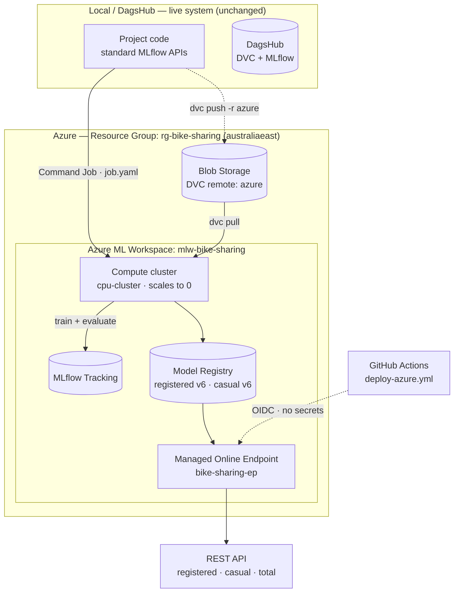
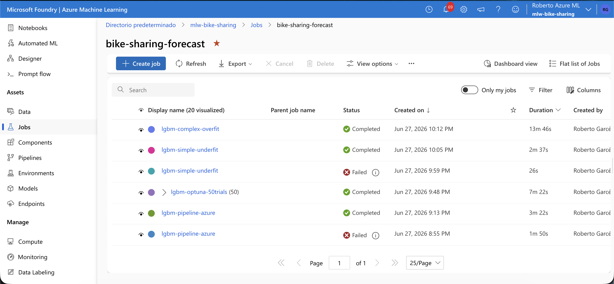
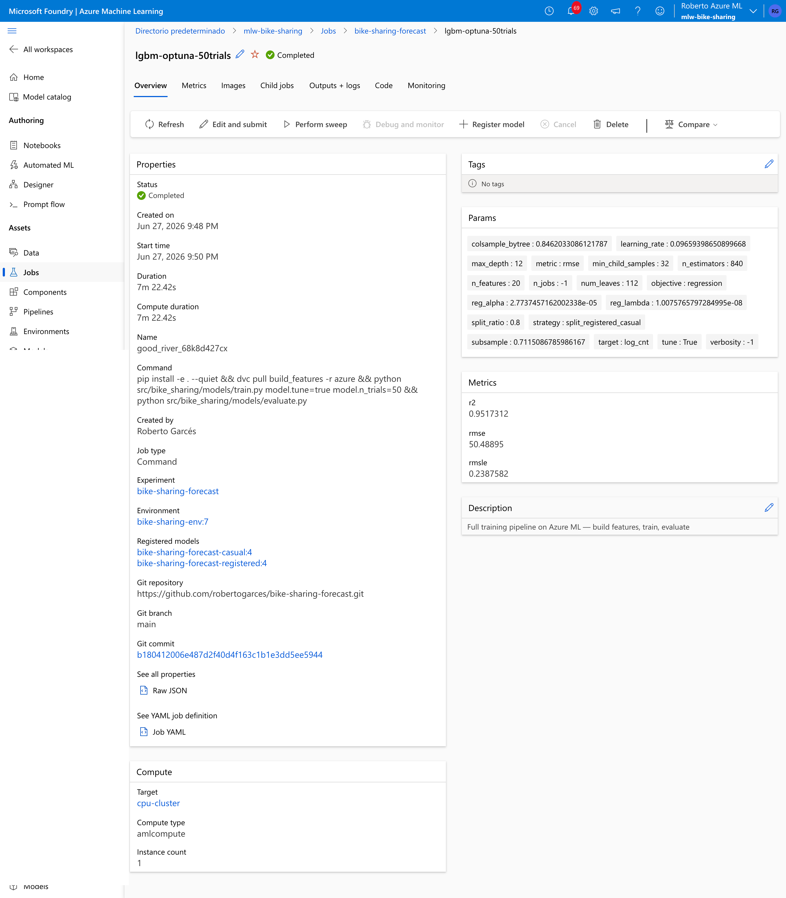

# Azure Deployment

This document describes the Azure ML deployment layer of the project: what was built, how the
pieces fit together, the design decisions behind them, and the practical lessons learned operating
the platform hands-on.

This layer is **demonstrative**. The goal is to show production-grade MLOps on a managed cloud
platform — not to run the system permanently. It runs **in parallel** with the existing DagsHub +
GitHub Actions setup; the live hourly system is never touched. Everything lives in a single Resource
Group so the whole stack can be torn down with one command after capturing evidence, keeping cost
under ~$10 of the free credit.

---

## Table of Contents

1. [Overview and goals](#1-overview-and-goals)
2. [Architecture](#2-architecture)
3. [Components](#3-components)
4. [Key files](#4-key-files)
5. [Cost management and teardown](#5-cost-management-and-teardown)
6. [Lessons learned](#6-lessons-learned)

---

## 1. Overview and goals

| Goal | How it is met |
|---|---|
| Demonstrate hands-on Azure ML skill | Workspace, training jobs, model registry, online endpoint, CI/CD |
| Keep the live system intact | Azure added as a **parallel** destination, toggled by environment variables |
| Minimise cost | Single Resource Group, compute that scales to zero, endpoint deleted after use |

**Key enabler:** the project code already uses **standard MLflow APIs** for logging, model
registration, and loading (`mlflow.lightgbm.log_model(...)`, `mlflow.lightgbm.load_model("models:/...")`).
Because Azure ML exposes a **built-in MLflow-compatible server**, pointing `MLFLOW_TRACKING_URI` at the
workspace makes experiment tracking and the model registry work with essentially no code change — only
configuration.

**Environment:** Resource Group `rg-bike-sharing`, Azure ML Workspace `mlw-bike-sharing`, region
`australiaeast`. Creating the workspace also provisions a Storage Account, Key Vault, Application
Insights, and a Container Registry.

---

## 2. Architecture



---

## 3. Components

### 3.1 Data versioning — DVC → Azure Blob Storage

A second DVC remote named `azure` was added **alongside** the existing `origin` (DagsHub), pointing at
a blob container on the workspace storage account. The default remote is never changed, so the live
system keeps using DagsHub:

```ini
['remote "azure"']
    url = azure://dvc-remote/data
    account_name = mlwbikesstorage7fbbf1c97
```

Versioned data and artifacts are pushed with `dvc push -r azure`, and the Azure training job pulls
them back with `dvc pull -r azure`.

<!-- Capture a screenshot of the blob container with the DVC files and save as docs/assets/azure-blob-dvc.png, then uncomment: -->
<!--  -->

### 3.2 Experiment tracking → Azure ML

`setup_mlflow()` ([src/bike_sharing/utils/mlflow_utils.py](../src/bike_sharing/utils/mlflow_utils.py))
reads `MLFLOW_TRACKING_URI` from the environment. Switching tracking from DagsHub to Azure ML is a
matter of changing that one variable — no code change. Inside an Azure ML job the variable is injected
automatically, so runs, parameters, metrics, and artifacts appear in **Azure ML Studio → Jobs** under
the `bike-sharing-forecast` experiment.



### 3.3 Training on Azure — Command Job

The full training pipeline runs **on Azure compute** (not just locally) via a Command Job
([azure/job.yaml](../azure/job.yaml)):

```yaml
command: >-
  pip install -e . --quiet &&
  dvc pull build_features -r azure &&
  python src/bike_sharing/models/train.py &&
  python src/bike_sharing/models/evaluate.py
environment: azureml:bike-sharing-env:7
compute: azureml:cpu-cluster
```

- **Compute:** `cpu-cluster` (AmlCompute) with `min_instances: 0` — it **scales to zero** when idle, so
  it only costs money during the minutes a job actually runs.
- **Environment:** a registered Azure ML Environment (`bike-sharing-env`) built from
  [azure/conda.yaml](../azure/conda.yaml), pinning the exact training dependencies.
- The job pulls features from the Azure DVC remote, trains both LightGBM models, evaluates them, and
  logs everything to the workspace MLflow server.



### 3.4 Model Registry

`train.py` registers two models in the **Azure ML Model Registry**:
`bike-sharing-forecast-registered` and `bike-sharing-forecast-casual`, each independently versioned
(currently **v6**). These are the artifacts the online endpoint loads at inference time.

<!--  -->

### 3.5 Managed Online Endpoint

A Managed Online Endpoint (`bike-sharing-ep`) serves both models behind a single REST API. The scoring
script ([azure/score.py](../azure/score.py)) loads both models in `init()` and, in `run()`, returns the
registered/casual split plus the total — mirroring the production `predict.py` logic:

```bash
az ml online-endpoint invoke \
  -n bike-sharing-ep \
  --request-file azure/sample_request.json \
  -g rg-bike-sharing -w mlw-bike-sharing
```

```json
{"registered": 190.0, "casual": 12.3, "total": 202.3}
```


The deployment runs on a single `Standard_DS1_v2` instance. This is the **only resource with a
per-hour cost**, so it is deleted as soon as evidence is captured.

### 3.6 CI/CD — GitHub Actions with OIDC federated auth

The deploy workflow ([.github/workflows/deploy-azure.yml](../.github/workflows/deploy-azure.yml)) runs
on `workflow_dispatch` (manual trigger only — never on a schedule, to avoid recreating the costly
endpoint). It authenticates to Azure using **OIDC federated credentials**: no client secret is stored
in GitHub. The federated credential is locked to this specific repo and branch, so tokens from any
other source are rejected by Azure Entra ID.

```yaml
permissions:
  id-token: write   # allows the runner to request a GitHub OIDC token
  contents: read
```

The workflow creates the endpoint, grants its managed identity access to the model registry, and
deploys the scoring container.


---

## 4. Key files

| File | Purpose |
|---|---|
| [azure/job.yaml](../azure/job.yaml) | Command Job: full training pipeline on Azure compute |
| [azure/environment.yaml](../azure/environment.yaml) | Azure ML Environment definition (training) |
| [azure/conda.yaml](../azure/conda.yaml) | Training environment dependencies |
| [azure/score.py](../azure/score.py) | Scoring script: loads both models, returns registered/casual/total |
| [azure/conda_endpoint.yaml](../azure/conda_endpoint.yaml) | Serving environment dependencies |
| [azure/endpoint.yaml](../azure/endpoint.yaml) | Managed Online Endpoint definition |
| [azure/deployment.yaml](../azure/deployment.yaml) | Deployment config (SKU, env vars, model version) |
| [azure/sample_request.json](../azure/sample_request.json) | Example request payload |
| [.github/workflows/deploy-azure.yml](../.github/workflows/deploy-azure.yml) | Manual deploy workflow with OIDC |

---

## 5. Cost management and teardown

| Resource | Cost | Note |
|---|---|---|
| Resource Group | $0 | Logical container only |
| Azure ML Workspace | $0 | The workspace itself is free |
| Storage Account + Blob (DVC) | cents | A few GB in LRS; negligible |
| Key Vault + App Insights | ~$0 | Created with the workspace; minimal use |
| Compute cluster (`cpu-cluster`) | $0 idle | `min_instances: 0` → scales to zero; cost only during training |
| Container Registry (Basic) | ~$5/mo | Fixed cost if left running; deleted at teardown |
| **Managed Online Endpoint** | **~$0.10–0.20/hr** | **Only per-hour cost.** No scale-to-zero; deleted after use |

Cost discipline followed throughout: the endpoint was deleted immediately after capturing evidence,
and compute was kept at zero idle nodes. To tear down the entire Azure stack in one command:

```bash
az group delete -n rg-bike-sharing --yes
```

---

## 6. Lessons learned

Real problems hit while building this, and how they were solved — the parts that don't show up in a
tutorial.

**Resource providers must be registered per subscription.** New subscriptions ship with many Azure
service providers disabled, and the online-endpoint create call masked the real cause as a generic
`SubscriptionNotRegistered [N/A]`. The fix was registering the missing providers
(`Microsoft.PolicyInsights`, `Microsoft.Cdn`, `Microsoft.Compute`, `Microsoft.Network`,
`Microsoft.ContainerService`). Diagnosing it required the `--debug` flag to see the real HTTP response.

**Azure ML does not implement MLflow model aliases.** The production code uses `models:/<name>@production`,
but Azure ML's MLflow-compatible API returns `404` for the alias endpoint. Models must be loaded by
explicit version instead (`models:/<name>/<version>`), pinned via the `MODEL_VERSION` environment
variable. Pinning a version is the correct choice for serving anyway — you want deliberate promotion,
not silent jumps.

**`MLFLOW_TRACKING_URI` is not auto-injected into endpoint containers.** Training jobs get it for free,
but online-endpoint containers do not — it must be set explicitly in `deployment.yaml` under
`environment_variables`. It is just a URL identifier, not a secret, so it is safe to commit.

**The serving environment must match the training environment.** A model that loads fine locally can
crash at startup in the container if dependencies differ. Specific gotchas:
- `scikit-learn` must be present to unpickle the `LGBMRegressor` MLflow flavor.
- `numpy` must be `<2` because `mlflow==2.15.1` pins it; using numpy 2 breaks the image build.
- Drop the conda `defaults` channel (Anaconda ToS breaks the build); keep only `conda-forge`.
- `azureml-inference-server-http` must be in the conda pip dependencies.

**Validate locally before deploying.** Building a throwaway virtualenv with the exact serving pins and
running `score.init()` + `score.run()` against the Azure registry catches load and dependency errors in
~2 minutes, versus ~15 minutes per remote deploy. This turned a slow remote error-loop into a fast
local one. Note it does **not** catch image-build conflicts, because Azure *mutates* the conda file
(injecting its own dependencies) — for those, read the build log in the storage container
`aml-environment-image-build`.

**A new endpoint gets a new managed identity.** That identity needs the `AzureML Data Scientist` role to
read the model registry, or `init()` fails with `403`. Because deleting and recreating the endpoint
generates a fresh identity, the role grant is automated inside the deploy workflow, followed by a short
`sleep` to let the assignment propagate before the deployment starts.
