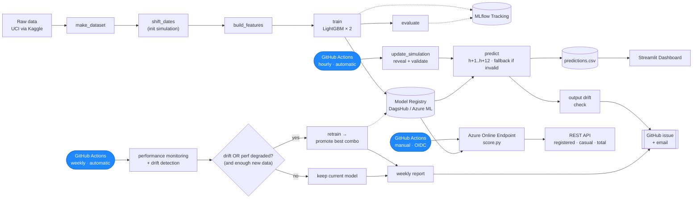

# Technical Overview

A guided, end-to-end tour of the bike sharing demand forecasting system — what it does, how it's built, and **why each design decision was made**. If you only read one document in this repository, read this one. Each section links to a deeper reference doc for the details.

This is not a usage manual (see [Setup & Usage](usage.md) for install and commands) — it's the engineering narrative.

---

## Table of Contents

1. [What This Project Is](#1-what-this-project-is)
2. [Key Results](#2-key-results)
3. [System Map](#3-system-map)
4. [The Simulation — a Live System From Static Data](#4-the-simulation--a-live-system-from-static-data)
5. [Data Ingestion & Quality Gating](#5-data-ingestion--quality-gating)
6. [Features & Model](#6-features--model)
7. [Serving: Recursive Multi-Horizon Forecasting](#7-serving-recursive-multi-horizon-forecasting)
8. [Monitoring Stack](#8-monitoring-stack)
9. [Retraining & Promotion](#9-retraining--promotion)
10. [Alerting](#10-alerting)
11. [CI/CD & Automation](#11-cicd--automation)
12. [Cloud: Parallel Azure ML Deployment](#12-cloud-parallel-azure-ml-deployment)
13. [Tech Stack & What This Demonstrates](#13-tech-stack--what-this-demonstrates)

---

## 1. What This Project Is

Bike sharing operators face a recurring operational question: **how many bikes will be needed in the next few hours?** Under-supply loses revenue and frustrates riders; over-supply wastes rebalancing effort.

This project is an **end-to-end, production-style ML system** that forecasts hourly bike demand and runs as if it were live: new data arrives every hour, predictions run continuously, the system validates its incoming data, monitors itself for drift and performance decay along three independent axes, retrains automatically when warranted, promotes models only when they measurably improve, and alerts a human when something needs attention.

It is deliberately built as a **demonstration of MLOps engineering**, not just a model in a notebook — the modelling is the smallest part; the machinery around it is the point. The whole system runs on **free-tier infrastructure** (GitHub Actions for orchestration, DagsHub for DVC storage + hosted MLflow), with a **parallel deployment on Azure ML** proving the same concepts on managed cloud.

---

## 2. Key Results

| Metric | Value | Plain-language meaning |
|---|---|---|
| **RMSE** | ~50.6 bikes/hr | On a typical hour, the forecast is off by ~51 bikes |
| **RMSLE** | ~0.23 | ~23% average relative error (the Kaggle metric for this dataset) |
| **R²** | ~0.95 | Explains ~95% of hourly demand variability |
| **Skill vs. seasonal-naive** | roughly halves h+1 error | The model cuts the error of "same hour last week" by about half |

Evaluated on a **strict temporal hold-out** (chronological 80/20 split — never a random split, which would leak future information into training). The seasonal-naive comparison matters: it proves the ML apparatus earns its keep rather than just matching a trivial rule. See the [Model Card](model_card.md) for the full performance breakdown and baseline comparison.

---

## 3. System Map

The system separates a **static pipeline** (a DVC DAG — reproducible and deterministic, run when code or data definitions change) from a **dynamic production layer** (stateful, run continuously on a schedule via GitHub Actions, operating on a moving data window). Keeping these apart is a deliberate choice: it prevents the common ML-project mistake of tangling pipeline orchestration with production automation, and it's why the `build_features` DVC stage is **frozen** — so hourly data arrival doesn't silently retrigger training.

The rest of this document walks the map left-to-right, then top-to-bottom through the dynamic layer. Full design detail: [Architecture](architecture.md).

---

## 4. The Simulation — a Live System From Static Data

**The problem:** the UCI Bike Sharing dataset is static historical data (2011–2012). A model trained on it once and evaluated once is a notebook exercise — there's no *new* data to predict, monitor, or drift against.

**The decision:** rather than fabricate synthetic data, `shift_dates.py` (run once, outside the DVC pipeline) applies a constant offset to every date so the most recent slice of real data sits in the near future relative to a configurable `reference_date`. As wall-clock time advances, `update_simulation.py` moves records from a "future" pool (`hour_future.csv`) to a "past" pool (`hour_past.csv`) **one hour at a time** — exactly as sensor or API readings would arrive in production. A guarded `simulation_state.json` records the configuration and prevents accidental re-initialization.

**A subtle invariant this creates:** only the date is shifted — the calendar features (`weekday`, `workingday`, `season`, ...) keep their *original* values, because those are what the model was trained on. Nothing downstream may recompute them from the shifted date, or it would silently desync the features from what the model learned. This "shift invariant" is documented in code and in [Forecasting § 8](forecasting.md#8-supporting-infrastructure-utc-time-and-the-shift-invariant). Relatedly, all pipeline timestamps use an explicit `utc_now()` helper rather than naive local time, so behavior doesn't depend on the runner's timezone.

**Why it's honest:** this is explicitly a *simulation of live operation* on real demand patterns, not a claim of real-time data. It buys the ability to exercise every production behavior — ingestion, prediction, drift detection, retraining, alerting — end-to-end. Full mechanics: [Simulation](simulation.md).

---

## 5. Data Ingestion & Quality Gating

Each hour, before anything is predicted, `update_simulation.py` runs the newly-revealed rows through `validate_data_quality()` — a schema check (all required columns present) and a range check (every field within its valid domain, e.g. `hr ∈ [0,23]`, normalized `temp ∈ [0,1]`, configured in `configs/validation/default.yaml`). The result is written to a `hourly_validation.json` flag.

**Why this matters — the system degrades gracefully instead of predicting on garbage.** `predict.py` reads that flag: if the latest data failed validation, it does **not** run the model on corrupt inputs. Instead it serves a **fallback forecast** — last week's actual demand at the same hour (a lag-168 trajectory) — and marks those predictions as fallback so they're visibly distinct in the log and dashboard. A real production system that blindly scored malformed data would emit confident nonsense; this one has an explicit, observable fallback path.

---

## 6. Features & Model

**Features** are engineered in `build_features.py` from the raw hourly series: lag features (`cnt_lag_1…168` — recent same-hour and same-weekday demand, the strongest predictors), `shift(1)` rolling means (smoothed trend that never leaks the current hour), and cyclic calendar encodings with interactions (`hr_sin/cos`, `hr_x_season`, `is_rush_hour`). Feature selection was validated with **mutual information**, and discarded features are documented with their reasons. The set is frozen via DVC so data arrival never silently rebuilds it. Full detail: [Feature Engineering](feature_engineering.md).

**Two models, not one.** Total demand `cnt` is the sum of `registered` (commuters — weekday double-peak) and `casual` (recreational — weekend midday peak) riders, which follow fundamentally different patterns. The system trains **separate LightGBM models** on `log(registered+1)` and `log(casual+1)` and sums their back-transformed predictions — better RMSE and cleaner SHAP interpretability than one model forced to learn both patterns. The trade-off (two models to version) is handled explicitly in the promotion logic (§9).

Other deliberate choices: **LightGBM over ARIMA/SARIMA** (multiple overlapping seasonalities + rich exogenous features that tree models absorb naturally); **log-transformed target** (right-skewed demand, aligns the objective with RMSLE); **Optuna** for tuning; **temporal split** (chronological, never random). Full model card: [Model Card](model_card.md).

---

## 7. Serving: Recursive Multi-Horizon Forecasting

The model is trained only on the **next hour (h+1)**, but production serves a **12-hour trajectory (h+1 … h+12)**. The key insight: rather than training 12 separate per-horizon models, the single h+1 model is **rolled out recursively** — each prediction is fed back in as a synthetic "actual" so the next step's lag features come from the model's own prior output, not from imputation.

**Why this design, backed by evidence:** an experiment (`notebooks/04_experimento_horizontes.ipynb`) compared a dedicated per-horizon model against the recursive rollout on the real feature pipeline. The recursive approach **won on both cost and accuracy** at every horizon beyond h+1 — the direct model loses its short-lag features as the horizon grows and its error plateaus, while the recursive rollout keeps them and stays consistently lower. One model, better numbers.

Because error still compounds with each recursive step, the system carries a **`primary_horizon` (=1)** concept: all single-value decisions (the retrain gate, output-drift check, report headline) filter to h+1, the only lead time comparable to the model's validation RMSE. `horizon` (=12) is a pure serving parameter — changing it needs no retraining. Full algorithm, storage schema (the `horizon` column and `(timestamp_predicted, horizon)` dedup key), and the primary-horizon pattern: [Forecasting](forecasting.md).

---

## 8. Monitoring Stack

The system watches itself along **three independent axes**, so a problem is caught regardless of *how* it manifests:

- **Input drift** (`drift_detection.py`, weekly) — Kolmogorov-Smirnov tests on feature distributions. A notable refinement: rather than comparing recent data against the whole training set (which mixes every season into one distribution), it compares against a **month-matched reference** — the same calendar month(s) — widening to neighboring months (±1) and only falling back to the full reference if a window is too thin (`min_reference_rows`). The reference itself is a snapshot frozen at the last promotion (§9), not the ever-advancing live data. Drift is attributed to *specific columns*, not just an aggregate share.
- **Output drift** (`output_drift_detection.py`, hourly) — watches the distribution of the predictions themselves (primary horizon only), catching model misbehavior that input drift might miss.
- **Live performance** (`performance_monitoring.py`, weekly) — once actuals arrive, computes rolling RMSE/RMSLE/MAE/R² **per horizon**, benchmarked against a **seasonal-naive baseline**, so "is the model still beating the trivial rule?" is always answerable.

A companion helper, `suggest_thresholds.py`, derives data-driven drift/degradation thresholds from accumulated history (e.g. a 90th-percentile band over ≥12 weeks) rather than leaving them hardcoded guesses. An operations **Streamlit dashboard** (two pages: **Operations** for what to act on now — the forecast trajectory, next peak/quietest; **Monitoring** for model health — live performance, per-horizon skill, drift status, retrain outcomes) makes all of it visible. Design detail: [Architecture § Dashboard](architecture.md#dashboard).

---

## 9. Retraining & Promotion

**Two triggers, OR'd** (`retrain.py`): retraining fires when **input drift** is detected *or* **live performance degrades** more than a configured margin (default 20%) past the frozen baseline — and only once **≥720 hours (~30 days)** of new data have accumulated since the last retrain, so the statistics are meaningful. Using performance decay as a first-class trigger (not just distributional drift) means the system reacts to the thing that actually matters — accuracy — even when the inputs look statistically unchanged. Over-triggering is safe by design, because promotion (below) only takes effect if the new pair is measurably better.

**Promotion is combination-based, not per-model.** Since deployed demand is the *sum* of the registered and casual models, their RMSEs aren't independently meaningful. So retraining evaluates **all four combinations** of (registered, casual) × (new, production) on the same validation set by their actual combined RMSE, and promotes the winner — which can be a **mixed pair** (e.g. a new registered model with the existing casual one). Because the current production pair is always one of the four candidates, **promotion can never regress combined accuracy.**

Two supporting decisions make this robust:
- The **drift reference is snapshotted at promotion time** and attached to the promoted model's MLflow run, so drift is always measured against what the live model actually learned — not against training data that keeps moving underneath it.
- The **performance baseline is frozen only on an actual promotion**, so a slowly-degrading model can't keep re-anchoring its own baseline and blind the degradation gate.

Full rationale and the residual atomicity caveat: [Architecture § 5](architecture.md#5-key-design-decisions) and [Known Issues](known-issues.md).

---

## 10. Alerting

Monitoring findings reach a human two ways, both built to **fail open, not closed**:

- A **weekly digest** — assembled by `weekly_report.py` from performance history, drift status, and the retrain outcome — opened as a **GitHub issue** and emailed. It runs with `if: always()` in CI, so the one week something breaks upstream is not the week nobody gets notified.
- **Hourly alerts** (`hourly_alert.py`) on output drift or data-quality failures, **deduplicated** (a `dedup_hours` window, per-type issue labels) so one ongoing problem doesn't spam.

Delivery itself is hardened: `send_email()` renders a small markdown subset to HTML (clients show raw markdown otherwise) and **never raises** — a bad SMTP secret must not fail the predict/retrain job it's attached to — but surfaces failures as a GitHub Actions `::warning::` annotation so they stay visible instead of silent.

---

## 11. CI/CD & Automation

Everything runs on **GitHub Actions**, no always-on server:
- **`ci.yml`** — on every push/PR: `ruff check` (lint), `ruff format --check`, and the full **156-test** Pytest suite.
- **`hourly.yml`** — reveal + validate new records → predict the h+1…h+12 trajectory → output-drift check → hourly alert → push updated data/state via DVC.
- **`weekly.yml`** — performance monitoring → input-drift detection → conditional retrain/promote → weekly report.
- **`deploy-azure.yml`** — manual, OIDC-authenticated deploy to the Azure endpoint (§12).

The hourly and weekly jobs both push data/DVC state to `main` and would collide every Monday at 00:00 UTC, so they share a **`concurrency: main-state`** group with `cancel-in-progress: false` — they serialize and wait rather than clobbering each other's push. Small detail, real production concern.

---

## 12. Cloud: Parallel Azure ML Deployment

Alongside the free-tier stack, the same MLOps concepts were re-implemented on **Azure ML** — DVC remote on Blob Storage, training as an Azure ML Command Job, tracking and registry in the workspace, a **managed online endpoint** (`score.py`) serving `registered / casual / total` over REST, and **OIDC federated auth** for keyless CI/CD deploys. It runs independently of the live DagsHub system without touching it.

One nuance worth calling out (it demonstrates real-deployment awareness): Azure ML's registry has no model *aliases*, so deployment pins explicit **registered/casual version numbers independently** — the direct consequence of the mixed-pair promotion in §9. A helper, `sync_deployment_versions.py`, reconciles those versions before a redeploy. Full walkthrough, cost, and lessons: [Azure](azure.md).

---

## 13. Tech Stack & What This Demonstrates

| Concern | Tooling |
|---|---|
| Modelling | LightGBM, Optuna, SHAP, scikit-learn |
| Data & pipeline | DVC, Hydra (config-driven, no hardcoded paths) |
| Experiment tracking & registry | MLflow (DagsHub-hosted + Azure ML) |
| Orchestration & CI/CD | GitHub Actions (hourly / weekly / OIDC deploy) |
| Serving | Streamlit dashboard, Azure ML managed online endpoint |
| Monitoring | Evidently, custom drift/performance modules, GitHub-issue + email alerting |
| Quality | Ruff (lint + format), Pytest (156 tests) |
| Cloud | Azure ML (Workspace, Model Registry, Managed Online Endpoint, Blob Storage) |

**What this project demonstrates as an engineering artifact:**
- Designing a system where the *model* is a small, replaceable part of a larger, observable, self-maintaining pipeline — with data-quality gating, a graceful fallback path, and three independent monitoring axes.
- Making — and **documenting the reasoning behind** — non-obvious decisions: serving-side multi-horizon, combination-based promotion, performance-triggered retraining, month-matched drift references, fail-open alerting, drift-reference snapshotting.
- Config-driven, linted, tested, reproducible code with data and experiment versioning.
- Portability of the whole approach from free-tier to managed cloud.

For the details behind any section above, follow its link — or start with [Architecture](architecture.md) for the full system design.
